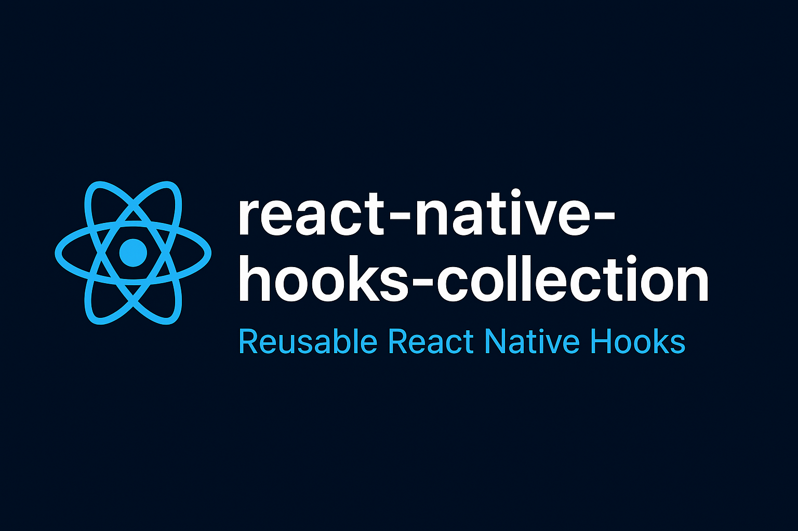

# react-native-hooks-collection
[](https://www.npmjs.com/package/react-native-hooks-collection)
[](https://www.npmjs.com/package/react-native-hooks-collection)
[](./LICENSE)
[](https://www.typescriptlang.org/)

A lightweight collection of reusable React Native hooks for faster, cleaner app development.

## 📖 About
`react-native-hooks-collection` is a **growing set of custom React Native hooks** that help you write **cleaner, more maintainable, and reusable** code.

Each hook solves a **real-world problem** — from handling keyboard visibility and device orientation to managing throttled callbacks and app state changes.

## ⚙️ Installation
You can install the package using either **npm**:

```
npm install react-native-hooks-collection
```
or **yarn**:
```
yarn add react-native-hooks-collection
```

## 🧩 Available Hooks
| Category  |	Hooks                                                                            |
|-----------|----------------------------------------------------------------------------------|
| Device    |	useDeviceOrientation, useDimensions                                              |
| System    |	useAppState, useInternetStatus, useKeyboard, useBackHandler                      |
| Utilities |	usePrevious, useToggle, useDebounce, useDebouncedCallback, useThrottledCallback  |
| Debugging |	useRenderCount, useLifecycleLogger, useLogChange                                 |
| Others    |	useCountdown, useCounter, useIsFirstRender, useStateRef                          |

## 🖼️ Example App
Explore the `/src/playground` folder.

## useKeyboard Demo


## useCountdown Demo


## useCounter Demo


## useDebounce Demo


## useDebouncedCallback Demo


## useDimensions Demo


## useOrientation Demo


## usePrevious Demo


## useRenderCount Demo


## useStateRef Demo


## useThrottledCallback Demo


## useToggle Demo


## 🔧 Upcoming Hooks

🚀 usePermission (For location & camera)

🚀 useCurrentLocation

🚀 useStorageState

## 🤝 Contributing
Contributions, issues, and feature requests are welcome!

🚨 Feel free to check the [issues page](https://github.com/HamidAliSE/react-native-hooks-collection/issues).

## License
This project is licensed under the **MIT License** – see the [LICENSE](./LICENSE) for more details.

## 🧠 Author
Hamid Ali

[LinkedIn](https://www.linkedin.com/in/HamidAliSE/) | [GitHub](https://github.com/HamidAliSE)

## ⭐️ Support
If this package helps you, please consider giving it a ⭐️ on GitHub — it motivates me to build more!
